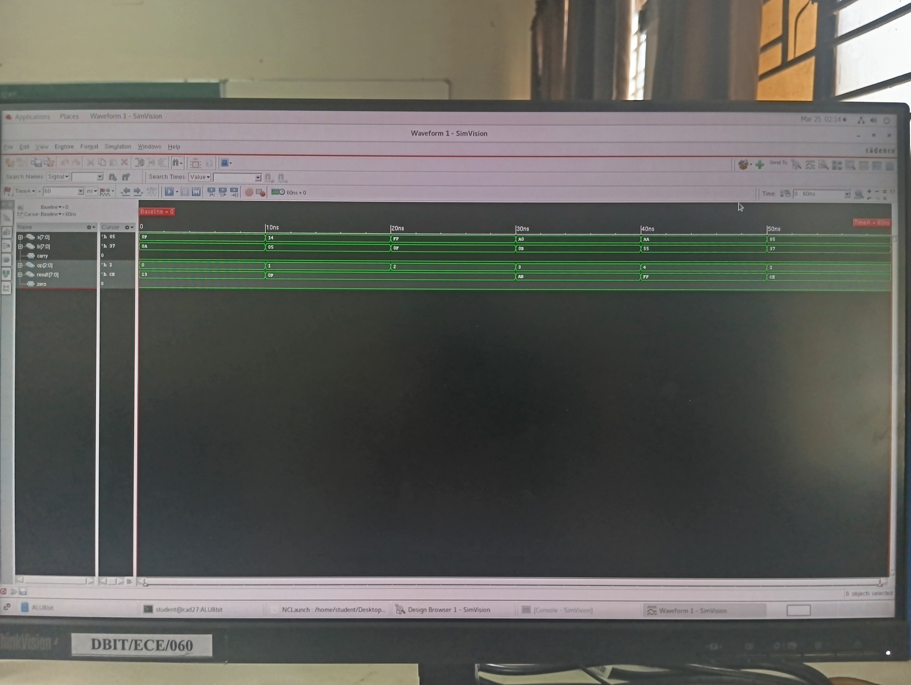
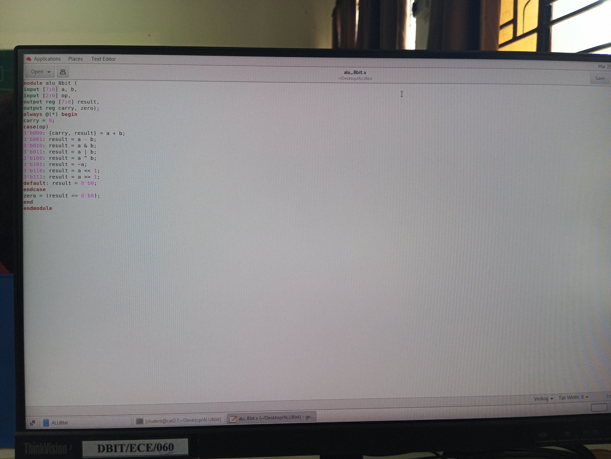
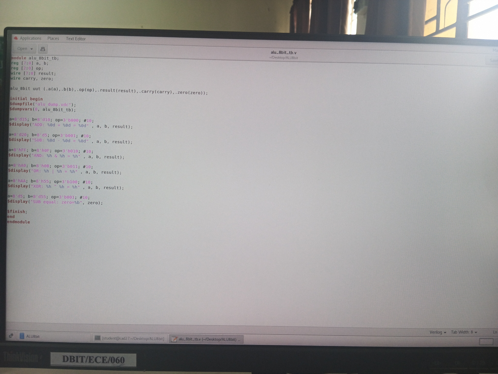
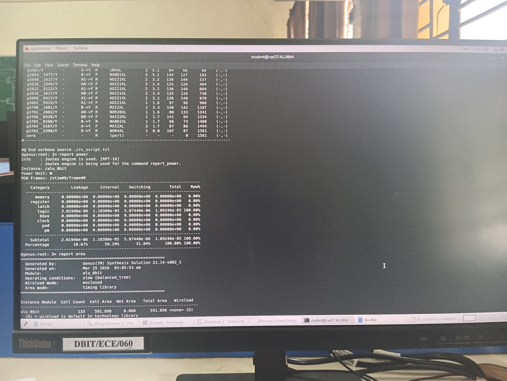
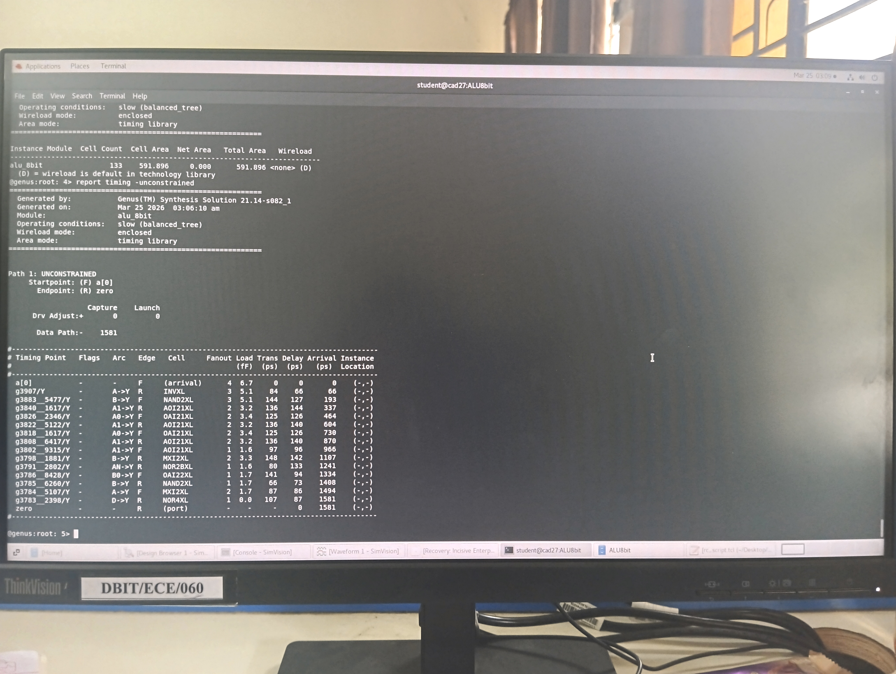
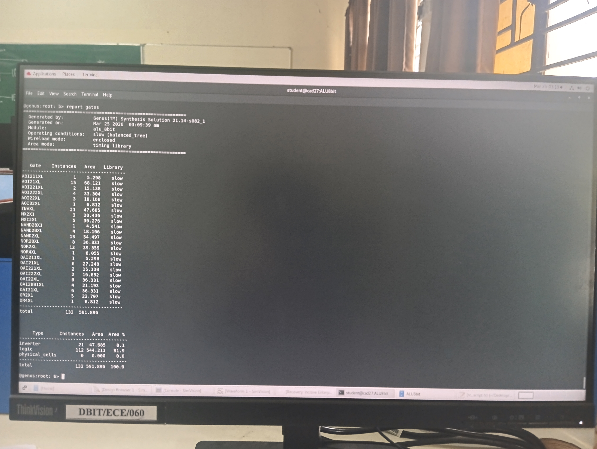
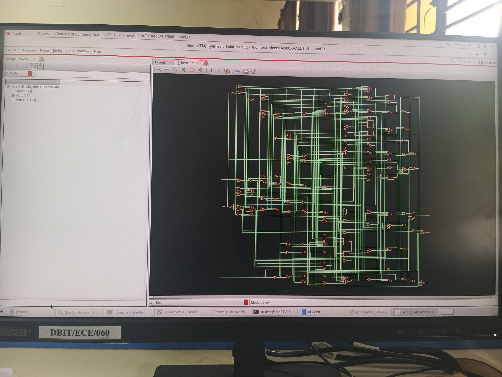

🔷 8-bit ALU Design, Simulation & Synthesis using Verilog

📌 Overview

This project implements an 8-bit ALU using Verilog.
The design is functionally verified using a Verilog testbench.
Simulation and synthesis were performed using Cadence tools.

🛠️ Tools Used

- Verilog
- Cadence Incisive (Simulation)
- Cadence Genus (Synthesis)

⚙️ Operations

- Addition
- Subtraction
- AND
- OR
- XOR

📊 Simulation

🧠 RTL Code

🧪 Testbench

📉 Synthesis Reports

Power and Area

Timing

Gate Count

🔧 Netlist

📂 Files

- alu.v
- alu_tb.v
- constraints.sdc

🎯 Learning Outcomes

- Designed an 8-bit ALU using Verilog HDL
- Performed functional verification using testbench
- Gained hands-on experience with Cadence simulation (Incisive)
- Understood synthesis flow using Cadence Genus
